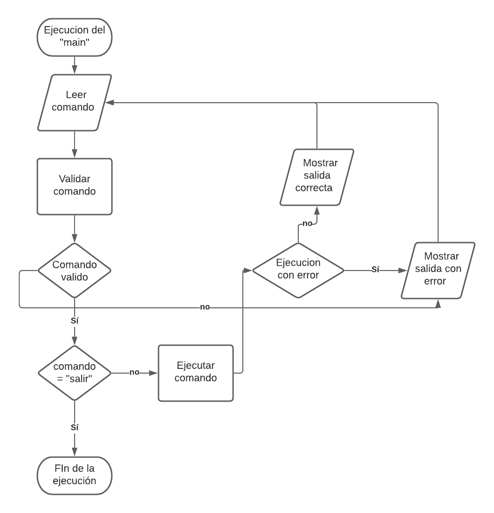
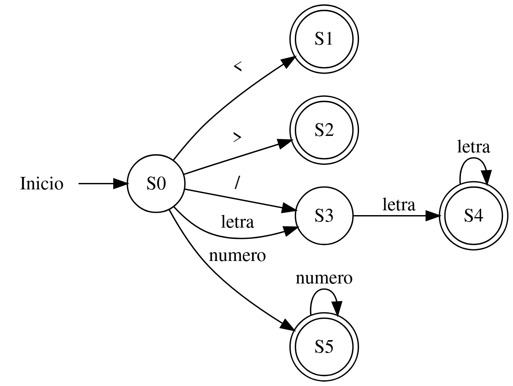
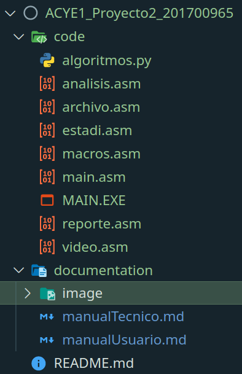

# Manual tecnico

## Introduccion

Este proyecto consiste en una calculadora estadistica de la cual se puede obtener datos como *media, mediana, moda, promedio, minimo, maximo* y graficas como *barras ascendente, barras descendnete, histograma y lineas* y un reporte que resume los datos que se pueden obtener mas una tabla de distribucion de frecuencias, todo esto para datos sin agrupar.

## Especificaciones tecnicas

### ***Software***
- DOSbox

### ***Hardware***

- Computador que soporte DOSbox

## Diagramas
### ***Diagrama de flujo***

### ***Automata finito determinista***

## Herramientas

- Editor: Visual Studio Code
- Lenguaje: Microsoft Macro Assembler **MASM**

## Estructura del codigo

### ***Directorio code***

Contiene el codigo del proyecto junto con el ejecutable

- *algoritmos.py:* Algoritmos utilizados en alto nivel.
- *analisis.asm:* Macros utilizados para el analisis lexico.
- *archivo.asm:* Macros de manejo de archivos.
- *estadi.asm:* Macros relacionados al calculo de los valores estadisiticos.
- *macros.asm:* Macros de uso general.
- *main.asm:* Archivo principal.
- *reporte.asm:* Macros necesarios para generar el reporte.
- *video.asm:* Macros necesarios para poder mostrar las graficas.

### ***Directorio documentation***

Contiene la documentacion en formato *markdown* del manual tecnico y de usuario.

## Uso

Escribir el nombre del ejecutable *"main"* en la consola de DOSbox.

## Consideraciones

1. El maximo de numeros distintos que soporta el programa son 100 para los analisis estadisticos y 76 para los graficos.

2. El maximo de numeros en el archivo de entrada pueden ser de hasta 1000 numeros.

3. La frecuencia admitida para un numero varia entre (4 - 655) para poder visualizar de manera corecta los graficos.