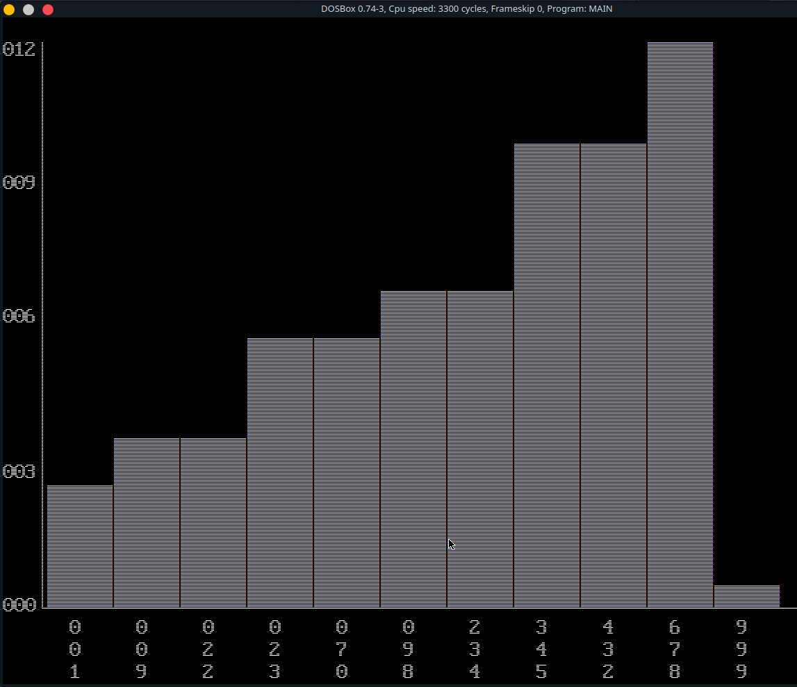

# Manual de usuario

Al iniciar la aplicacion se le presentara una consola que esperara por instrucciones para poder ser ejecutadas.


## Comandos disponibles

A continuación se describen los comandos que la aplicación puede reconocer.

- **abrir_*"ruta"***
    <br />Este comando espera como argumento en "ruta" la ruta del archivo de entrada con extensión .xml para poder ser cargado.<br />
    

- **cprom**
    <br />Este comando nos retornara el promedio de datos respecto al archivo de entrada.<br />
    

- **cmediana**
    <br />Este comando nos retornara la mediana de los datos respecto al archivo de entrada.<br />
    

- **cmoda**
    <br />Este comando nos retornara la moda de los datos respecto al archivo de entrada.<br />
    

- **cmax**
    <br />Este comando nos retornara el numero maximo respecto al archivo de entrada.<br />
    

- **cmin**
    <br />Este comando nos retornara el numero minimo respecto al archivo de entrada.<br />
    

- **gbarra_asc**
    <br />Este comando desplegara una grafica de barras ordenada ascendentemente respecto a las frecuencias de los numeros del archivo de entrada.<br />
    

- **gbarra_desc**
    <br />Este comando desplegara una grafica de barras ordenada descendentemente respecto a las frecuencias de los numeros del archivo de entrada.<br />
    

- **ghist**
    <br />Este comando desplegara una grafica de barras ordenada ascendentemente respecto a los numeros del archivo de entrada.<br />
    

- **glinea**
    <br />Este comando desplegara una grafica de lineas ordenada ascendentemente respecto a los numeros del archivo de entrada.<br />
    

- **reporte**
    <br />Este comando nos desplegara un reporte con todos los valores estadisticos descritos en los comandos anteriores, los datos del estudiant, fecha, hora y la tabla de frecuencias
    <br />
    
    ```
    Nombre: Jose Carlos I Alonzo Colocho
    Carnet: 201700965

    Fecha: 09/05/2021
    Hora: 14:11

    Mediana: 234.000
    Promedio: 284.485
    Moda: 678
    Maximo: 999
    Minimo: 001

    +--------+------------+
    | Numero | Frecuencia |
    +--------+------------+
    |  001   |    003     |
    |  009   |    004     |
    |  022   |    004     |
    |  023   |    006     |
    |  070   |    006     |
    |  098   |    007     |
    |  234   |    007     |
    |  345   |    010     |
    |  432   |    010     |
    |  678   |    012     |
    |  999   |    001     |
    +--------+------------+
    ```

- **limpiar**
    <br />Este comando limpiara la consola<br />

- **info**
    <br />Este comando desplegara la informacion del estudiante<br />
    

- **salir**
    <br />Con este comando podra salirse de la ejecucion del programa<br />
<br />
---
Nota
1. Para los comandos que necesitan calculos estadisticos es necesario cargar un archivo de entrada previamente. 
2. Los comandos que por alguna razon tuvieran un problema en su ejecucion mostraran la consola de salida en rojo con un mensaje denotando que sucedio en su ejecucion, si todo se ejecuta correctamente se mostrara en verde.
---